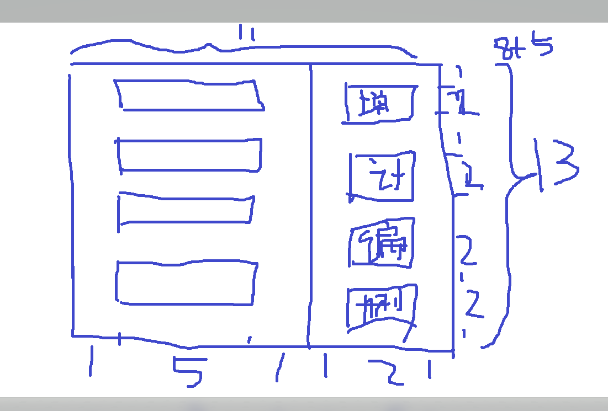
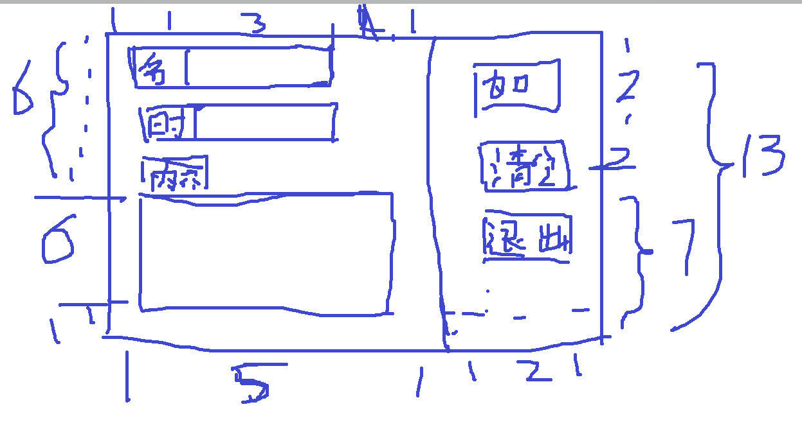
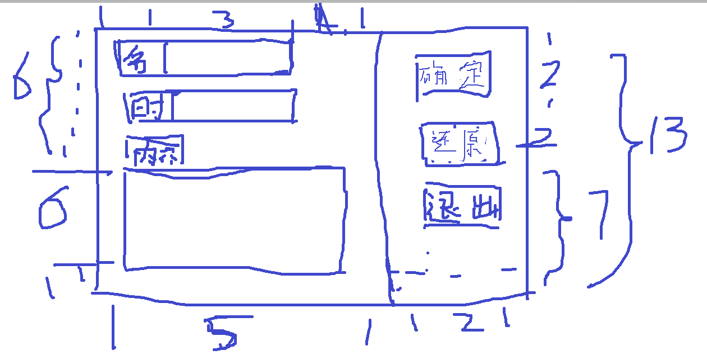
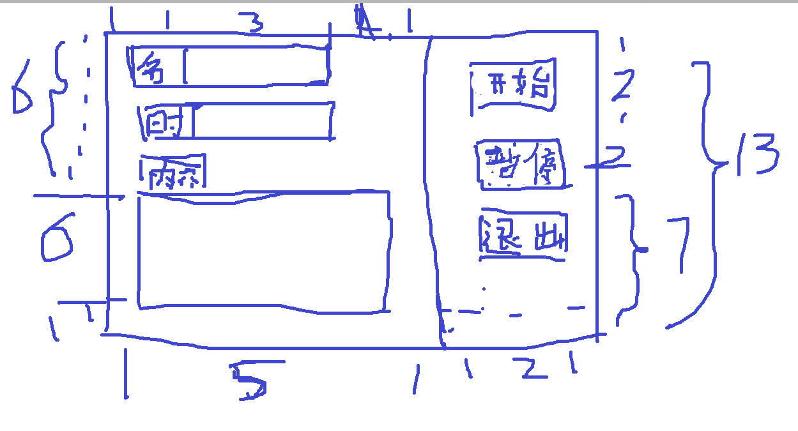

# 桌面代做任务清单,MyTodoList

### 功能迭代

1. 显示一个可以增加，删除，编辑，开始的todolist.

   里面的任务显示在一个可以滚动的空间里面，所以可以无限地添加

2. 增加文件存储功能，退出程序后再进入时显示的仍然是是上一次自己输入的任务

### ui设计

首页界面

点击添加按钮，则会显示添加面板。

选中某个任务之后按下编辑按钮，进入编辑面板

选中某个任务之后按下删除键就能够删除某个任务

选中某个任务之后按下计时键，该任务开始计时，从剩余时间开始计时，每次修改任务信息都会重置计时

### 模块划分

### 遇到的问题和解决的技术方案

1. 在有限的区域内显示更多的任务

   使用滚动面板JScrollPanel。任务作为控件添加到JPanel上，再通过一个以该JPanel为参数构造的JScrollPane实例对该JPanel进行管理，使之成为滚动面板

2. 实现滚动面板单选。也就是滚动面板中的任务只能选择单个，或者不选。

   也就是如果两次选中同一个任务，则取消选中，如果选中一个新的任务，则旧的任务取消选中。

   使用观察者模式实现该功能。任务获取选中事件后通知任务面板，再由面板决定如何改变他们的选中状态。也就是说任务条是信息发布者，任务滚动面板是观察者

3. 实现程序主面板和功能面板的切换。也是使用观察者模式。

   功能面板继承基础功能面板，也就是继承一个抽象类，基础功能面板里面有一个退出按钮，获取该按钮点击事件后，功能面板会通知主面板，由主面板决定如何切换界面。

4. 